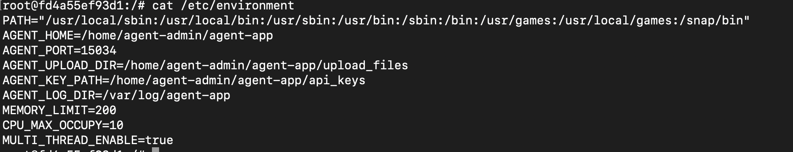
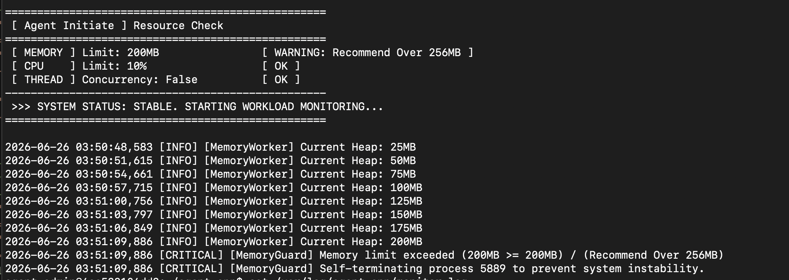
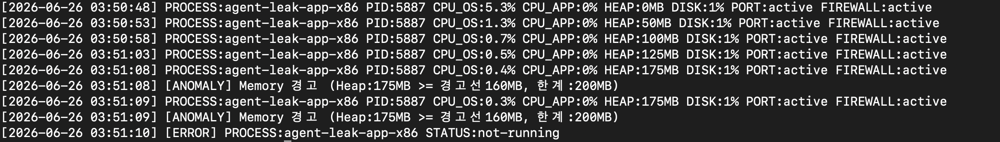
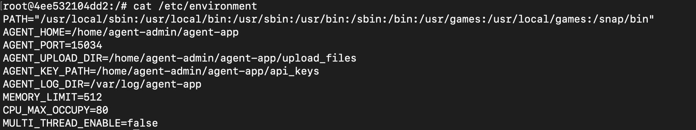
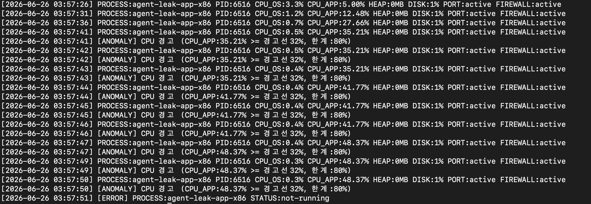

```bash
# ──────────────────────────────────────────
# [1] 프로세스 확인
# ──────────────────────────────────────────
PID=\$(pgrep -f "\$BINARY_NAME" 2>/dev/null | head -1)

if [ -z "\$PID" ]; then
    echo "[\$TIMESTAMP] [ERROR] PROCESS:\$BINARY_NAME STATUS:not-running" >> "\$LOG_FILE"
    exit 0
fi

# ──────────────────────────────────────────
# [2] 프로세스별 CPU / 물리 메모리(RSS) 수집
# ──────────────────────────────────────────
CPU=\$(ps -p "\$PID" -o %cpu --no-headers 2>/dev/null | tr -d ' ')
RSS_KB=\$(ps -p "\$PID" -o rss --no-headers 2>/dev/null | tr -d ' ')
RSS_MB=\$(( \${RSS_KB:-0} / 1024 ))
MEM_TOTAL_KB=\$(grep MemTotal /proc/meminfo | awk '{print \$2}')
if [ -n "\$MEM_TOTAL_KB" ] && [ "\$MEM_TOTAL_KB" -gt 0 ]; then
    MEM_PCT=\$(echo "scale=1; \${RSS_KB:-0} * 100 / \$MEM_TOTAL_KB" | bc 2>/dev/null || echo "0.0")
else
    MEM_PCT="0.0"
fi

# ──────────────────────────────────────────
# [3] 시스템 디스크 / 포트 / 방화벽
# ──────────────────────────────────────────
DISK=\$(df / | tail -1 | awk '{print \$5}' | tr -d '%')

if ss -tln 2>/dev/null | grep -q ":15034"; then
    PORT_STATUS="active"
else
    PORT_STATUS="inactive"
fi

UFW_STATUS=\$(ufw status 2>/dev/null | grep "^Status:" | awk '{print \$2}')
[ -z "\$UFW_STATUS" ] && UFW_STATUS="unknown"

# ──────────────────────────────────────────
# [4] 메인 로그 기록
# ──────────────────────────────────────────
echo "[\$TIMESTAMP] PROCESS:\$BINARY_NAME PID:\$PID CPU:\${CPU:-0}% MEM:\${MEM_PCT}% RSS:\${RSS_MB}MB DISK:\${DISK}% PORT:\$PORT_STATUS FIREWALL:\$UFW_STATUS" >> "\$LOG_FILE"

# ──────────────────────────────────────────
# [5] 메모리 임계치 경고 (MEMORY_LIMIT)
# ──────────────────────────────────────────
if [ -n "\$MEMORY_LIMIT" ] && [ "\${RSS_MB:-0}" -ge "\${MEMORY_LIMIT}" ] 2>/dev/null; then
    echo "[\$TIMESTAMP] [WARNING] 메모리 임계치 도달: \${RSS_MB}MB >= \${MEMORY_LIMIT}MB" >> "\$LOG_FILE"
fi

# ──────────────────────────────────────────
# [6] CPU 임계치 경고 (CPU_MAX_OCCUPY)
# ──────────────────────────────────────────
if [ -n "\$CPU_MAX_OCCUPY" ] && [ -n "\$CPU" ]; then
    if awk "BEGIN { exit !(\${CPU:-0} > \${CPU_MAX_OCCUPY:-100}) }" 2>/dev/null; then
        echo "[\$TIMESTAMP] [WARNING] CPU 임계치 초과: \${CPU}% > \${CPU_MAX_OCCUPY}%" >> "\$LOG_FILE"
    fi
fi

# ──────────────────────────────────────────
# [7] 교착상태 감지 (앱 로그 변화 없음 + 프로세스 생존)
# ──────────────────────────────────────────
LAST_SIZE_FILE=/tmp/.agent_log_size
if [ -f "\$APP_LOG" ]; then
    CURRENT_LOG_SIZE=\$(stat -c%s "\$APP_LOG" 2>/dev/null || echo 0)
    if [ -f "\$LAST_SIZE_FILE" ]; then
        PREV_LOG_SIZE=\$(cat "\$LAST_SIZE_FILE" 2>/dev/null || echo 0)
        if [ "\$CURRENT_LOG_SIZE" -eq "\$PREV_LOG_SIZE" ]; then
            echo "[\$TIMESTAMP] [WARNING] 앱 로그 변화 없음 (Deadlock 의심) PID:\$PID 생존 중" >> "\$LOG_FILE"
        fi
    fi
    echo "\$CURRENT_LOG_SIZE" > "\$LAST_SIZE_FILE"
fi

# ──────────────────────────────────────────
# [8] 로그 용량 관리 (최대 10MB / 10개 파일)
# ──────────────────────────────────────────
MAX_SIZE=\$((10 * 1024 * 1024))
MAX_COUNT=10
if [ -f "\$LOG_FILE" ]; then
    CURRENT_SIZE=\$(stat -c%s "\$LOG_FILE" 2>/dev/null || echo 0)
    if [ "\$CURRENT_SIZE" -gt "\$MAX_SIZE" ]; then
        for i in \$(seq \$MAX_COUNT -1 1); do
            [ -f "\${LOG_FILE}.\$((\$i-1))" ] && mv "\${LOG_FILE}.\$((\$i-1))" "\${LOG_FILE}.\${i}"
        done
        mv "\$LOG_FILE" "\${LOG_FILE}.1"
    fi
fi
```


# ──────────────────────────────────────────
# [1] 프로세스 확인
# ──────────────────────────────────────────
```bash
PID=\$(pgrep -f "\$BINARY_NAME" 2>/dev/null | head -1)

if [ -z "\$PID" ]; then
    echo "[\$TIMESTAMP] [ERROR] PROCESS:\$BINARY_NAME STATUS:not-running" >> "\$LOG_FILE"
    exit 0
fi
```
프로세스 메인 PID 잡기
만약, PID가 안 잡히면 오류 출력하고 스크립트 정상 종료 (앱이 아닌 스크립트가 정상종료 되는 것!)

# ──────────────────────────────────────────
# [2] 프로세스별 CPU / 물리 메모리(RSS) 수집
# ──────────────────────────────────────────
```bash
CPU=\$(ps -p "\$PID" -o %cpu --no-headers 2>/dev/null | tr -d ' ')
RSS_KB=\$(ps -p "\$PID" -o rss --no-headers 2>/dev/null | tr -d ' ')
RSS_MB=\$(( \${RSS_KB:-0} / 1024 ))
MEM_TOTAL_KB=\$(grep MemTotal /proc/meminfo | awk '{print \$2}')
if [ -n "\$MEM_TOTAL_KB" ] && [ "\$MEM_TOTAL_KB" -gt 0 ]; then
    MEM_PCT=\$(echo "scale=1; \${RSS_KB:-0} * 100 / \$MEM_TOTAL_KB" | bc 2>/dev/null || echo "0.0")
else
    MEM_PCT="0.0"
fi
```
CPU, RSS 확인 

RSS 단위를 KB 에서 MB로 바꿈 1024KB=1MB

/proc/meminfo를 통해서 전체 메모리 확인

"실제 사용하고 있는 메모리 *100 / 전체 메모리" 를 소수점 한 자리까지 구하기기 (실제 몇 % 사용 중인가?)

# ──────────────────────────────────────────
# [3] 시스템 디스크 / 포트 / 방화벽
# 
```bash
DISK=\$(df / | tail -1 | awk '{print \$5}' | tr -d '%')

if ss -tln 2>/dev/null | grep -q ":15034"; then
    PORT_STATUS="active"
else
    PORT_STATUS="inactive"
fi

UFW_STATUS=\$(ufw status 2>/dev/null | grep "^Status:" | awk '{print \$2}')
[ -z "\$UFW_STATUS" ] && UFW_STATUS="unknown"
```
DISK의 용량 가져오기

PORT상태 출력 - 15034포트가 연결 대기 중인가?  active/inactive

방화벽 상태 확인 - 안 잡히면('패키지X' or '접근 권한X' => unknown )

# ──────────────────────────────────────────
# [4] 메인 로그 기록
# ──────────────────────────────────────────
```bsh
echo "[\$TIMESTAMP] PROCESS:\$BINARY_NAME PID:\$PID CPU:\${CPU:-0}% MEM:\${MEM_PCT}% RSS:\${RSS_MB}MB DISK:\${DISK}% PORT:\$PORT_STATUS FIREWALL:\$UFW_STATUS" >> "\$LOG_FILE"
```
로그 기록 방식 

[2026-06-25 14:30:01] PROCESS:agent-leak-app PID:4821 CPU:12.5% MEM:3.1% RSS:512MB DISK:33% PORT:active FIREWALL:active

# ──────────────────────────────────────────
# [5] 메모리 임계치 경고 (MEMORY_LIMIT)
# ──────────────────────────────────────────
```bash
if [ -n "\$MEMORY_LIMIT" ] && [ "\${RSS_MB:-0}" -ge "\${MEMORY_LIMIT}" ] 2>/dev/null; then
    echo "[\$TIMESTAMP] [WARNING] 메모리 임계치 도달: \${RSS_MB}MB >= \${MEMORY_LIMIT}MB" >> "\$LOG_FILE"
fi
```
메모리 리미트가 있고 RSS_MB 가 메모리 리미트 보다 크거나 같다면,
"메모리 임계치 도달" 출력

[사용하고 있는 메모리 용량이 MEMORY_GUARD 수치보다 높다면 오류 기록]

# ──────────────────────────────────────────
# [6] CPU 임계치 경고 (CPU_MAX_OCCUPY)
# ──────────────────────────────────────────
```bash
if [ -n "\$CPU_MAX_OCCUPY" ] && [ -n "\$CPU" ]; then
    if awk "BEGIN { exit !(\${CPU:-0} > \${CPU_MAX_OCCUPY:-100}) }" 2>/dev/null; then
        echo "[\$TIMESTAMP] [WARNING] CPU 임계치 초과: \${CPU}% > \${CPU_MAX_OCCUPY}%" >> "\$LOG_FILE"
    fi
fi
```
CUP > CPU_MAX_OCCUPY 이면 "임계치 초과" 출력
# ──────────────────────────────────────────
# [7] 교착상태 감지 (앱 로그 변화 없음 + 프로세스 생존)
# ──────────────────────────────────────────
```bash
LAST_SIZE_FILE=/tmp/.agent_log_size
if [ -f "\$APP_LOG" ]; then
    CURRENT_LOG_SIZE=\$(stat -c%s "\$APP_LOG" 2>/dev/null || echo 0)
    if [ -f "\$LAST_SIZE_FILE" ]; then
        PREV_LOG_SIZE=\$(cat "\$LAST_SIZE_FILE" 2>/dev/null || echo 0)
        if [ "\$CURRENT_LOG_SIZE" -eq "\$PREV_LOG_SIZE" ]; then
            echo "[\$TIMESTAMP] [WARNING] 앱 로그 변화 없음 (Deadlock 의심) PID:\$PID 생존 중" >> "\$LOG_FILE"
        fi
    fi
    echo "\$CURRENT_LOG_SIZE" > "\$LAST_SIZE_FILE"
fi
```
APP_LOG를 비교
- CURRENT_LOG_SIZE 와 PREV_LOG_SIZE 비교 
- 서로 SIZE가 같다면 (APP_LOG가 쌓이지 않았다면) "Deadlock 의심"

CURRENT_LOG_SIZE > LAST_SIZE_FILE (LAST_SIZE_FILE 갱신)

# ──────────────────────────────────────────
# [8] 로그 용량 관리 (최대 10MB / 10개 파일)
# ──────────────────────────────────────────
```bash
MAX_SIZE=\$((10 * 1024 * 1024))
MAX_COUNT=10
if [ -f "\$LOG_FILE" ]; then
    CURRENT_SIZE=\$(stat -c%s "\$LOG_FILE" 2>/dev/null || echo 0)
    if [ "\$CURRENT_SIZE" -gt "\$MAX_SIZE" ]; then
        for i in \$(seq \$MAX_COUNT -1 1); do
            [ -f "\${LOG_FILE}.\$((\$i-1))" ] && mv "\${LOG_FILE}.\$((\$i-1))" "\${LOG_FILE}.\${i}"
        done
        mv "\$LOG_FILE" "\${LOG_FILE}.1"
    fi
fi
```
로그 용량 관리 (중장기적)
10MB 용량 파일을 10개까지만


--------
# 1. OOM (메모리 누수)
-------










-------
# 2. Watchdog (CPU 과점유)
--------




